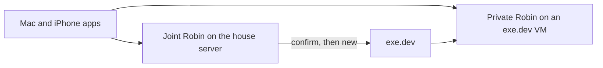

# Privacy

Robin keeps personal data on the instance that is helping that person. A model provider receives a task only after an explicit opt-in and a clean redaction report. Family members do not share inboxes, vaults, or browser sessions.

A fully compromised disk is out of scope. Whoever has root on the house server can read the joint disk. exe.dev operates the host of a private VM and can read that disk and memory. Account separation stops the assistant from mixing people. It is not a defense against the host administrator.

## Where it runs

The joint assistant is the default: one Robin on the in-house Linux server. Shared resources, such as a household grocery list, live there. Browser profiles, vaults, and credentials stay per account even though the operating system is shared.

A private instance is optional, one per person who asks. After a confirmation, the joint server calls exe.dev `new --json` and waits until the instance reports ready. The app then offers that assistant. Nobody copies a hostname or runs an installer.

The VM starts from a pinned image, `robin/exeuntu:pinned`. `deploy/Dockerfile` builds it from exeuntu, so the first-boot hook exists, and installs Robin with `uv sync --frozen --no-dev`. The unit is on disk and stays disabled. Shelley and SSH are not enabled. `new --setup-script` only writes a one-time enroll token, the joint URL, and starts the service. exe.dev runs that script as `exedev`, so the script uses `sudo`. It stays under the 10KiB limit. `--no-email` is set. Shelley is not prompted. The create call is `POST https://exe.dev/exec` with the exe.dev token in the `Authorization` header, not in the command. The API reply includes `https_url`. `robin boot` on the VM reads the token, posts it to `{joint}/v1/enroll`, and deletes the file. The joint server marks that instance ready and the token dies, including across a restart of the house process. A second post of the same token is rejected.

Mailbox and other credentials are connected afterward, from the app to the private instance. They are not placed in the exe.dev create call. The exe.dev API token stays in the broker on the joint server. The model never sees it. Support login on the VM stays off.

The exe.dev URL is public, so Robin on the VM still requires that person's session. The joint server remembers the VM name and address. It does not receive a copy of the private vault. Nothing is synced across the joint assistant and a private instance unless that person later exports it.

Creating or deleting a VM spends money and starts a machine, so it waits for a confirm.

## Clients

The Mac and iPhone apps are shells. Each person signs in and messages their assistant. Python stays on the server. One airlock serves both apps. The phone does not run the assistant offline.

Apps talk only to the instance they are using. Connector credentials and model API keys live on that instance, scoped to the account that connected them.

## Accounts

Records a capability marks private, plus vocabulary, vault, cloud opt-in, and the activity log, belong to one account. A task's model context contains that account's data plus shared resources the account is a member of. The local model process starts a fresh context per task.

Placeholder maps are keyed by account and conversation. `[PERSON_1]` in one conversation is unrelated to `[PERSON_1]` in another. Sharing something with another account is an external effect and needs a confirm.

A person registers a password once, then logs in. The session token is returned once and is not stored. Later requests send it as a bearer token. The session has to belong to the account on the request. Another account's token is rejected. The one-time VM enroll token is separate and is not a person's session.

On the house server, `HouseholdStore` keeps accounts, threads, vaults, vocabulary, and the activity log. Thread text, vaults, vocabulary, and activity entries are encrypted with a key the process holds. A restart loads only that material. One account's threads and log are not readable as another account. The raw message is not stored in the clear.

The house HTTP service is how the Mac and iPhone apps will send a message. A turn returns a reply or a confirmation. Confirming runs the external tool that was waiting. Thread, activity, and private-instance routes require that account's session. `serve` still binds to the local machine. A pending confirmation is stored encrypted and is not visible to another account.

## Trust boundary

Connectors and computer-use see real records for the account that owns them. The cloud model sees placeholders. The local model may see that task's data. Secrets never enter either model: the broker holds them and tools receive them only at execution time.

The same airlock runs on the joint server and on a private VM.

## Routes

- **Local.** Used unless the task sets `allow_cloud`. The model runs on that instance. No personal data is sent to a model provider.
- **Cloud.** Requires the opt-in and a clean report. A clean scan never selects the cloud route by itself.

Fail closed. A critical value, or free text the local NER pass did not resolve, keeps the task on the local model. The gate is `policy.py`. It is not a second model.

`converse` asks the model only after that decision. On the local route the model sees the account's text with secrets already removed. On the cloud route it sees placeholders. Tool results sent back to a cloud model are redacted again. A reply is restored for the person, and a secret in that reply is dropped. An external tool returns a confirmation and does not run. A tool the account cannot see is refused.

## What is critical

Three classes:

- **Drop.** Never enters a model context and is never restored: API keys, passwords, cookies, recovery codes, national IDs including Norwegian fødselsnummer, and payment data (card numbers, IBAN, kontonummer).
- **Tokenize.** Reversible placeholders, stable for one conversation: names, emails, phones, street addresses. `Jane Doe <jane@example.com>` becomes `[PERSON_1] <[EMAIL_1]>`.
- **Free text.** Bodies, titles, notes, and screen text. The cloud sees them only after the deterministic pass plus a local NER pass, and only if nothing is left unresolved. Otherwise the field is withheld from the cloud view.

Ordinary text, such as a grocery item name, is still scanned. A secret typed into an ordinary field is dropped.

## Detection

All of this runs on the instance.

1. **Deterministic floor.** Email, phone, fødselsnummer (mod-11), organisasjonsnummer, kontonummer, IBAN, card numbers (Luhn), secrets by prefix and entropy, and a per-account vocabulary of names and places.
2. **Local NER, optional.** [GLiNER](https://huggingface.co/urchade/gliner_multi_pii-v1) for names, addresses, and organizations in mixed Norwegian and English. Weights stay on disk. If the pass is unavailable, free-text cloud egress stays blocked. A cloud model is never the detector.
3. **Vault.** In memory for one account's conversation. Encrypted with Fernet when a session is saved. The map is never appended to a cloud request and never opened for a different account.
4. **Restore.** Cloud replies and tool arguments are restored only inside the core. Dropped values stay dropped.

A Norwegian GLiNER checkpoint can plug into the same `Ner` interface later. Checksums still decide fødselsnummer and account numbers.

## Capabilities

A capability is trusted code on the server. It sees raw records for the accounts that enabled it. It does not call a model provider and it does not redact on its own. The core runs every tool argument and every tool result through the airlock.

The mail connector reads that account's inbox over IMAP and sends over SMTP. The calendar connector reads and writes that account's CalDAV calendar. The host, user, and password stay in the broker. The tools do not accept them, and a login failure does not repeat the password.

Tools declare an effect:

- `read` looks
- `mutate` changes something on the machine inside the task the person just gave
- `external` sends, deletes, pays, shares, or submits, and waits for a confirm

Records coming back from a capability are untrusted. On the cloud path the model does not hold the raw values. On the local path it does hold task data, so external effects still wait for a confirm.

Each tool call is appended to that account's activity log with secrets dropped. Another account cannot read the log. Mailbox and calendar secrets live in the broker. With a household store they are encrypted and survive a restart. The app can connect them for the signed-in account. The response does not return the secret.

## Using the computer

When a service has an API, the assistant uses that connector. Computer-use is the fallback: a browser on that instance. The assistant's computer is the house server, or that person's exe.dev VM. The Mac and the iPhone are clients. One account does not drive another person's VM, and the joint server does not drive a private VM's browser.

The model sees text, not a raw screenshot. Passwords, national IDs, and payment fields are drop. A click inside the task is `mutate`. Submitting, sending, paying, deleting, typing a password, or accepting a permission dialog is `external`. Text on the screen is data, including text that tries to instruct the model.

`Browser` drives a page on that instance. Playwright supplies the live page. The model receives the accessible text. A password field is dropped. A click or ordinary typing is `mutate`. Submitting and typing a password wait for a confirm. Tests stand in for the page and do not launch Chromium.

## Proactive work

A scheduled check stays off until that account turns it on with `POST /v1/schedule`. `tick` then runs a local check of mail and calendar for the accounts that asked. An external action is stored for confirmation and does not run on its own. Memory stays on the instance, per account, and goes through the airlock before any cloud model.
