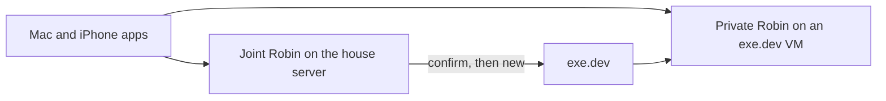

# Privacy

Robin keeps personal data on the instance that is helping that person. A model provider receives a task only after an explicit opt-in and a clean redaction report. Family members do not share inboxes, vaults, or browser sessions.

A fully compromised disk is out of scope. Whoever has root on the house server can read the joint disk. exe.dev operates the host of a private VM and can read that disk and memory. Account separation stops the assistant from mixing people. It is not a defense against the host administrator.

## Where it runs

The joint assistant is the default: one Robin on the in-house Linux server. Shared resources, such as a household grocery list, live there. Browser profiles, vaults, and credentials stay per account even though the operating system is shared.

A private instance is optional, one per person who asks. After a confirmation, the joint server calls exe.dev `new --json` and waits until the instance reports ready. The app then offers that assistant. Nobody copies a hostname or runs an installer.

The VM starts from a pinned image, `nimul/robin:pinned`. `deploy/Dockerfile` builds it from exeuntu, so the first-boot hook exists, and installs Robin with `uv sync --frozen --no-dev`. The unit is on disk and stays disabled. Shelley and SSH are not enabled. `new --setup-script` only writes a one-time enroll token, the joint URL, and starts the service. exe.dev runs that script as `exedev`, so the script uses `sudo`. It stays under the 10KiB limit. `--no-email` is set. Shelley is not prompted. The create call is `POST https://exe.dev/exec` with the exe.dev token in the `Authorization` header, not in the command. The API reply includes `https_url`. `robin boot` on the VM reads the token, posts it to `{joint}/v1/enroll`, and deletes the file. The joint server marks that instance ready and the token dies, including across a restart of the house process. A second post of the same token is rejected.

Mailbox and other credentials are connected afterward, from the app to the private instance. They are not placed in the exe.dev create call. The exe.dev API token stays in the broker on the joint server. An operator places it once with `robin exe-token`, which encrypts it into the household store and deletes the file. The app cannot set it. The model never sees it. Support login on the VM stays off.

The VM listens on `127.0.0.1:8000`, the port exe.dev forwards to the public hostname. The create call then runs `share set-public`, so the phone is not sent to an exe.dev login page. Robin on the VM still requires that person's session. The joint server remembers the VM name and address. It does not receive a copy of the private vault. A person can seal their own vault with a passphrase and import that bundle on another instance. The passphrase is not stored. Another account cannot import it. Nothing else is copied between the joint assistant and a private instance.

Creating a VM spends money and starts a machine, so it waits for a confirm. Deleting one does too. `POST /v1/private` with `"delete": true` waits, then the joint server sends `rm robin-{account} --json` and forgets the address. The exe.dev token stays out of that command.

## Clients

The Mac and iPhone apps are shells. Each person signs in and messages their assistant. Python stays on the server. One airlock serves both apps. The phone does not run the assistant offline.

Apps talk only to the instance they are using. Connector credentials and model API keys live on that instance, scoped to the account that connected them.

## Accounts

Records a capability marks private, plus vocabulary, vault, cloud opt-in, and the activity log, belong to one account. A task's model context contains that account's data plus shared resources the account is a member of. Each model call is a new request. Robin sends the recent turns of that conversation with it, so the thread continues. An open page contributes an excerpt. The prompt stays within about 6,000 characters, which fits a 4096-token local context together with the tool list and the reply. Another conversation is left out. On the cloud route those turns are redacted the same way as the current message.

Placeholder maps are keyed by account and conversation. `[PERSON_1]` in one conversation is unrelated to `[PERSON_1]` in another. Sharing something with another account is an external effect and needs a confirm.

A person registers a password once, then logs in. The session token is returned once and is not stored. Later requests send it as a bearer token. The session has to belong to the account on the request. Another account's token is rejected. The one-time VM enroll token is separate and is not a person's session.

On the house server, `HouseholdStore` keeps accounts, threads, vaults, vocabulary, and the activity log. Thread text, vaults, vocabulary, and activity entries are encrypted with a key the process holds. A restart loads only that material. One account's threads and log are not readable as another account. The raw message is not stored in the clear.

The house HTTP service is how the Mac and iPhone apps will send a message. A turn returns a reply or a confirmation. Confirming runs the external tool that was waiting. Thread, activity, and private-instance routes require that account's session. `serve` binds to the local machine unless the house unit says otherwise. `deploy/robin-house.service` listens on `0.0.0.0` so a Mac or iPhone on the house network can sign in. A session is still required. The same unit reads `/etc/robin/advertise.url` and sends that address to a new private VM as the joint URL. A missing or invalid file does not invent one. A pending confirmation is stored encrypted and is not visible to another account.

## Trust boundary

Connectors and computer-use see real records for the account that owns them. The remote model sees placeholders, or `[UNRESOLVED]` when free text did not clear. Secrets never enter the model: the broker holds them and tools receive them only at execution time.

The same airlock runs on the joint server and on a private VM.

## Routes

The model is remote. There is no local generator. Every string sent to it is the airlock view: `release` in `airlock.py`. A clean scan never selects a raw view.

- **Drop.** A password, national ID, or payment value is replaced with `[REDACTED]` and is not restored.
- **Tokenize.** A detected name, email, phone, or street address becomes a placeholder for that conversation.
- **Withhold.** Mail, page text, file contents, tool results, and earlier turns are free text. If the local NER pass is missing or did not clear them, the model receives `[UNRESOLVED]` and the raw text stays on the machine.

`allow_cloud` still records that this task may use a provider. It does not reveal records. A critical value or unresolved free text keeps `cloud_payload` empty, and the model is still shown only `redacted`. The gate is `policy.py`. It is not a second model.

`converse` sends that redacted view. Fetched text is released again before it is appended. A reply is restored for the person, and a secret in that reply is dropped. An external tool returns a confirmation and does not run. A tool the account cannot see is refused. The person can still be shown a page or an inbox that the model was not allowed to read.

## What is critical

Three classes:

- **Drop.** Never enters a model context and is never restored: API keys, passwords, cookies, recovery codes, national IDs including Norwegian fødselsnummer, and payment data (card numbers, IBAN, kontonummer).
- **Tokenize.** Reversible placeholders, stable for one conversation: names, emails, phones, street addresses. `Jane Doe <jane@example.com>` becomes `[PERSON_1] <[EMAIL_1]>`.
- **Free text.** Bodies, titles, notes, and screen text. The cloud sees them only after the deterministic pass plus a local NER pass, and only if nothing is left unresolved. Otherwise the field is withheld from the cloud view.

Ordinary text, such as a grocery item name, is still scanned. A secret typed into an ordinary field is dropped.

## Detection

All of this runs on the instance.

1. **Deterministic floor.** Email, phone, fødselsnummer (mod-11), organisasjonsnummer, kontonummer, IBAN, card numbers (Luhn), secrets by prefix and entropy, and a per-account vocabulary of names and places.
2. **Local NER, optional.** [GLiNER](https://huggingface.co/urchade/gliner_multi_pii-v1) for names, addresses, and organizations in mixed Norwegian and English. Weights stay on disk. If the pass is unavailable, free-text cloud egress stays blocked. A cloud model is never the detector.
3. **Vault.** In memory for one account's conversation. Encrypted with Fernet when a session is saved. The map is never appended to a cloud request and never opened for a different account.
4. **Restore.** Cloud replies and tool arguments are restored only inside the core. Dropped values stay dropped.

A Norwegian GLiNER checkpoint can plug into the same `Ner` interface later. Checksums still decide fødselsnummer and account numbers.

## Capabilities

A capability is trusted code on the server. It sees raw records for the accounts that enabled it. It does not call a model provider and it does not redact on its own. The core runs every tool argument and every tool result through the airlock.

The mail connector reads that account's inbox over IMAP and sends over SMTP. The calendar connector reads and writes that account's CalDAV calendar. The host, user, and password stay in the broker. The tools do not accept them, and a login failure does not repeat the password.

Tools declare an effect:

- `read` looks
- `mutate` changes something on the machine inside the task the person just gave
- `external` sends, deletes, pays, shares, or submits, and waits for a confirm

Records coming back from a capability are untrusted. On the cloud path the model does not hold the raw values. On the local path it does hold task data, so external effects still wait for a confirm.

Each tool call is appended to that account's activity log with secrets dropped. Another account cannot read the log. Mailbox, calendar, website sign-in secrets, Home Assistant tokens, MCP bearer tokens, MCP OAuth tokens (and dynamic client registration), and the personal profile live in the broker. With a household store they are encrypted and survive a restart. The app can connect a mailbox or calendar for the signed-in account. The response does not return the secret. The app can also edit that account's personal profile (`GET`/`POST /v1/profile`): name, email, phone, and address fields. Those values are filled into forms with `browser_fill_profile` and never appear in tool arguments or model prompts. Website passwords, OTP codes, Home Assistant tokens, and MCP secrets are collected with status `input` forms (or a text fallback on older clients), stored for that account, and never sent to a model. MCP OAuth uses the same `input` status with an authorize link (`open_url`); the browser callback is `GET /v1/mcp/oauth/callback` and does not require a Robin session. Thread history records only field labels. Another account cannot read them.

MCP servers sit inside the trust boundary when attached. Remote HTTP tool arguments that restore a placeholder wait for confirm (egress). Every MCP tool result is untrusted data and goes through the airlock like page text. stdio servers run as that account's login with a minimal environment and no store key. Household shared servers come from `/etc/robin/mcp.json` and are read-only in chat. `GET /v1/mcp` lists names and status without secrets.

## Using the computer

When a service has an API, the assistant uses that connector. Computer-use is the fallback: a browser for websites, and AT-SPI for desktop apps on that instance. The assistant's computer is the house server, or that person's exe.dev VM. The Mac and the iPhone are clients. One account does not drive another person's VM, and the joint server does not drive a private VM's browser.

The model opens an http or https page with browser_open when the request needs one. The model sees a structured accessible-text snapshot (URL, interactive refs, main content), not a raw screenshot. Passwords, national IDs, and payment fields are drop. A click inside the task is `mutate`. Writing a file in that account's directory is `mutate`. Submitting, sending, paying, deleting, typing a password, running a command, or accepting a permission dialog is `external`. The confirm text shows the command with secrets removed. After that confirm, the command runs as that account's login. The login owns that directory and is not allowed to read the store key. Another account's directory is separate. Robin can read files owned by the operating-system user it runs as. A directory owned by another user is not entered, and a file owned by another user is not read. As root, that person is `ROBIN_USER`; with it unset, other people's files stay closed. Photo search uses the same rule. A local vision model turns each picture into a vector stored encrypted for that account. The picture itself is not sent to a model provider. The first search can download the vision weights onto this machine. Without that model, Robin says photo search is unavailable. The command's environment is only its path, home, and temporary directory. Text on the screen is data, including text that tries to instruct the model.

`Browser` drives a page on that instance. Playwright supplies the live page. Opening or reading the page returns numbered interactive refs so the model can click or type without screenshots. A page snapshot seeds the operator loop: the model may keep clicking and typing until the task is done, or answer from Content. After a confirm for submit or a password, the loop continues with the new snapshot. The model receives the airlock view of that snapshot. Uncleared page text stays on the machine. A password field is dropped. A click or ordinary typing is `mutate`. Submitting and typing a password wait for a confirm. Tests stand in for the page and do not launch Chromium. The private image installs Chromium for that VM. The house server is a separate machine and does not use that image. On the house, Chromium is installed with `playwright install chromium` in the Robin environment. A checkout also uses `.ms-playwright` beside the repository when that directory contains Chromium and the home cache does not. Without that binary, opening a page stops and Robin says so.

## Proactive work

A scheduled check stays off until that account turns it on with `POST /v1/schedule`, from the app. `robin tick` then runs a local check of mail and calendar for the accounts that asked. `deploy/robin-tick.timer` is the house timer. The running server also checks automations about once a minute.

When that background turn needs a confirm or an input form, Robin also writes an encrypted notification for that account. The signed-in app polls `GET /v1/notifications` and can show a local alert. Another account cannot read those items. Remote Apple Push is not used.

An automation comes from a sentence, for example a day summary every day at 08:00, a check every hour, or a reminder in 15 minutes. A repeating interval keeps running. A delay such as “in 15 minutes” runs once. It belongs to that account, stays on the instance, and runs on the local model. The result is saved for that account. Another account cannot list, change, or cancel it. An external action during a run is stored for confirmation and does not run on its own. The timer's output is a count. Memory stays on the instance, per account, and goes through the airlock before any cloud model.
